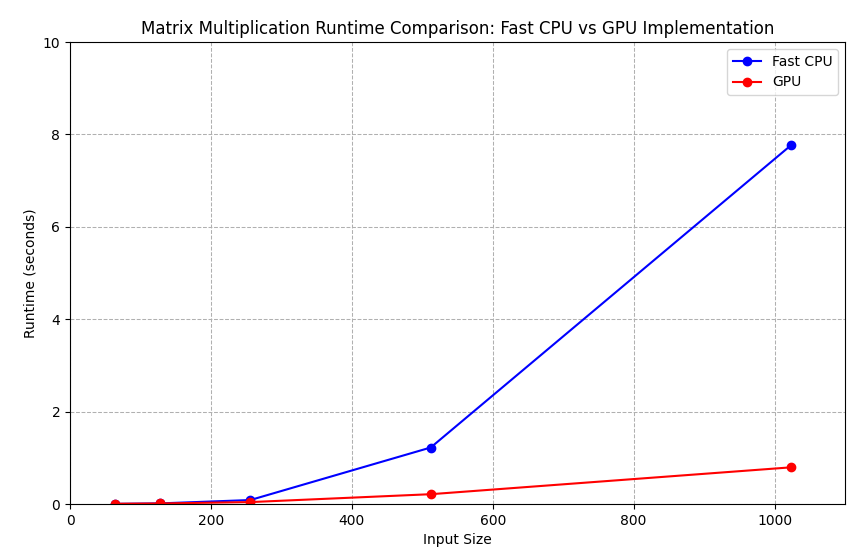

# MiniTorch Module 3


* Docs: https://minitorch.github.io/

* Overview: https://minitorch.github.io/module3.html


You will need to modify `tensor_functions.py` slightly in this assignment.

* Tests:

```bash
python run_tests.py
```

* Note:

Several of the tests for this assignment will only run if you are on a GPU machine and will not
run on github's test infrastructure. Please follow the instructions to setup up a colab machine
to run these tests.

This assignment requires the following files from the previous assignments. You can get these by running

```bash
python sync_previous_module.py previous-module-dir current-module-dir
```

The files that will be synced are:

        minitorch/tensor_data.py minitorch/tensor_functions.py minitorch/tensor_ops.py minitorch/operators.py minitorch/scalar.py minitorch/scalar_functions.py minitorch/module.py minitorch/autodiff.py minitorch/module.py project/run_manual.py project/run_scalar.py project/run_tensor.py minitorch/operators.py minitorch/module.py minitorch/autodiff.py minitorch/tensor.py minitorch/datasets.py minitorch/testing.py minitorch/optim.py

## Task 3.1 & Task 3.2 Parallel Check Output:

The terminal command used to run the parallel analytics script parallel_check.py provided in the repository is:

```bash
python project/parallel_check.py
```

The diagnostics output of the parallel analytics script from the terminal is as follows:

```console
MAP

================================================================================
 Parallel Accelerator Optimizing:  Function tensor_map.<locals>._map, /Users/ste
phen_shen/Desktop/ML_Engineering/workspace/mod3-
Stephen0512/minitorch/fast_ops.py (164)
================================================================================


Parallel loop listing for  Function tensor_map.<locals>._map, /Users/stephen_shen/Desktop/ML_Engineering/workspace/mod3-Stephen0512/minitorch/fast_ops.py (164)
-------------------------------------------------------------------------------------|loop #ID
    def _map(                                                                        |
        out: Storage,                                                                |
        out_shape: Shape,                                                            |
        out_strides: Strides,                                                        |
        in_storage: Storage,                                                         |
        in_shape: Shape,                                                             |
        in_strides: Strides,                                                         |
    ) -> None:                                                                       |
        # Check if the tensors are stride-aligned                                    |
        if (                                                                         |
            len(out_strides) == len(in_strides)                                      |
            and np.array_equal(out_strides, in_strides)                              |
            and np.array_equal(out_shape, in_shape)                                  |
        ):                                                                           |
            # Fast path: tensors are stride-aligned, avoid indexing                  |
            for i in prange(out.size):-----------------------------------------------| #0
                out[i] = fn(in_storage[i])                                           |
            return                                                                   |
                                                                                     |
        # Slow path: tensors are not stride-aligned                                  |
                                                                                     |
        # Process each element of the output tensor in parallel                      |
        for i in prange(out.size):---------------------------------------------------| #1
            # Initialize index arrays for input and output tensors                   |
            out_index = np.empty(MAX_DIMS, np.int32)  # Output tensor index          |
            in_index = np.empty(MAX_DIMS, np.int32)   # Input tensor index           |
                                                                                     |
            # Convert flat index i to tensor indices for output tensor               |
            to_index(i, out_shape, out_index)                                        |
                                                                                     |
            # Handle broadcasting between tensors to get input tensor index          |
            broadcast_index(out_index, out_shape, in_shape, in_index)                |
                                                                                     |
            # Convert indices to positions in storage                                |
            in_pos = index_to_position(in_index, in_strides)   # Input position      |
            out_pos = index_to_position(out_index, out_strides) # Output position    |
                                                                                     |
            # Apply function and store result                                        |
            out[out_pos] = fn(in_storage[in_pos])                                    |
--------------------------------- Fusing loops ---------------------------------
Attempting fusion of parallel loops (combines loops with similar properties)...
Following the attempted fusion of parallel for-loops there are 2 parallel for-
loop(s) (originating from loops labelled: #0, #1).
--------------------------------------------------------------------------------
----------------------------- Before Optimisation ------------------------------
--------------------------------------------------------------------------------
------------------------------ After Optimisation ------------------------------
Parallel structure is already optimal.
--------------------------------------------------------------------------------
--------------------------------------------------------------------------------

---------------------------Loop invariant code motion---------------------------
Allocation hoisting:
The memory allocation derived from the instruction at /Users/stephen_shen/Deskto
p/ML_Engineering/workspace/mod3-Stephen0512/minitorch/fast_ops.py (188) is
hoisted out of the parallel loop labelled #1 (it will be performed before the
loop is executed and reused inside the loop):
   Allocation:: out_index = np.empty(MAX_DIMS, np.int32)  # Output tensor index
    - numpy.empty() is used for the allocation.
The memory allocation derived from the instruction at /Users/stephen_shen/Deskto
p/ML_Engineering/workspace/mod3-Stephen0512/minitorch/fast_ops.py (189) is
hoisted out of the parallel loop labelled #1 (it will be performed before the
loop is executed and reused inside the loop):
   Allocation:: in_index = np.empty(MAX_DIMS, np.int32)   # Input tensor index
    - numpy.empty() is used for the allocation.
None
ZIP

================================================================================
 Parallel Accelerator Optimizing:  Function tensor_zip.<locals>._zip, /Users/ste
phen_shen/Desktop/ML_Engineering/workspace/mod3-
Stephen0512/minitorch/fast_ops.py (230)
================================================================================


Parallel loop listing for  Function tensor_zip.<locals>._zip, /Users/stephen_shen/Desktop/ML_Engineering/workspace/mod3-Stephen0512/minitorch/fast_ops.py (230)
-----------------------------------------------------------------------------------------|loop #ID
    def _zip(                                                                            |
        out: Storage,                                                                    |
        out_shape: Shape,                                                                |
        out_strides: Strides,                                                            |
        a_storage: Storage,                                                              |
        a_shape: Shape,                                                                  |
        a_strides: Strides,                                                              |
        b_storage: Storage,                                                              |
        b_shape: Shape,                                                                  |
        b_strides: Strides,                                                              |
    ) -> None:                                                                           |
        # Check if the tensors are stride-aligned                                        |
        if (                                                                             |
            len(out_strides) == len(a_strides) == len(b_strides)                         |
            and np.array_equal(out_strides, a_strides)                                   |
            and np.array_equal(out_strides, b_strides)                                   |
            and np.array_equal(out_shape, a_shape)                                       |
            and np.array_equal(out_shape, b_shape)                                       |
        ):                                                                               |
            # Fast path: tensors are stride-aligned, avoid indexing                      |
            for i in prange(out.size):---------------------------------------------------| #2
                out[i] = fn(a_storage[i], b_storage[i])                                  |
            return                                                                       |
                                                                                         |
        # Slow path: tensors are not stride-aligned                                      |
                                                                                         |
        # Process each element in the output tensor in parallel                          |
        for i in prange(out.size):-------------------------------------------------------| #3
                                                                                         |
            # Initialize index arrays for input and output tensor indices                |
            out_index = np.empty(MAX_DIMS, np.int32)  # Output tensor index              |
            a_index = np.empty(MAX_DIMS, np.int32)    # First input tensor index         |
            b_index = np.empty(MAX_DIMS, np.int32)    # Second input tensor index        |
                                                                                         |
            # Convert flat index i to tensor indices for output tensor                   |
            to_index(i, out_shape, out_index)                                            |
                                                                                         |
            # Handle broadcasting between tensors to get input tensor indices            |
            broadcast_index(out_index, out_shape, a_shape, a_index)                      |
            broadcast_index(out_index, out_shape, b_shape, b_index)                      |
                                                                                         |
            # Convert indices to positions in storage                                    |
            a_pos = index_to_position(a_index, a_strides)     # First input position     |
            b_pos = index_to_position(b_index, b_strides)     # Second input position    |
            out_pos = index_to_position(out_index, out_strides) # Output position        |
                                                                                         |
            # Apply function and store result                                            |
            out[out_pos] = fn(a_storage[a_pos], b_storage[b_pos])                        |
--------------------------------- Fusing loops ---------------------------------
Attempting fusion of parallel loops (combines loops with similar properties)...
Following the attempted fusion of parallel for-loops there are 2 parallel for-
loop(s) (originating from loops labelled: #2, #3).
--------------------------------------------------------------------------------
----------------------------- Before Optimisation ------------------------------
--------------------------------------------------------------------------------
------------------------------ After Optimisation ------------------------------
Parallel structure is already optimal.
--------------------------------------------------------------------------------
--------------------------------------------------------------------------------

---------------------------Loop invariant code motion---------------------------
Allocation hoisting:
The memory allocation derived from the instruction at /Users/stephen_shen/Deskto
p/ML_Engineering/workspace/mod3-Stephen0512/minitorch/fast_ops.py (260) is
hoisted out of the parallel loop labelled #3 (it will be performed before the
loop is executed and reused inside the loop):
   Allocation:: out_index = np.empty(MAX_DIMS, np.int32)  # Output tensor index
    - numpy.empty() is used for the allocation.
The memory allocation derived from the instruction at /Users/stephen_shen/Deskto
p/ML_Engineering/workspace/mod3-Stephen0512/minitorch/fast_ops.py (261) is
hoisted out of the parallel loop labelled #3 (it will be performed before the
loop is executed and reused inside the loop):
   Allocation:: a_index = np.empty(MAX_DIMS, np.int32)    # First input tensor
index
    - numpy.empty() is used for the allocation.
The memory allocation derived from the instruction at /Users/stephen_shen/Deskto
p/ML_Engineering/workspace/mod3-Stephen0512/minitorch/fast_ops.py (262) is
hoisted out of the parallel loop labelled #3 (it will be performed before the
loop is executed and reused inside the loop):
   Allocation:: b_index = np.empty(MAX_DIMS, np.int32)    # Second input tensor
index
    - numpy.empty() is used for the allocation.
None
REDUCE

================================================================================
 Parallel Accelerator Optimizing:  Function tensor_reduce.<locals>._reduce, /Use
rs/stephen_shen/Desktop/ML_Engineering/workspace/mod3-
Stephen0512/minitorch/fast_ops.py (303)
================================================================================


Parallel loop listing for  Function tensor_reduce.<locals>._reduce, /Users/stephen_shen/Desktop/ML_Engineering/workspace/mod3-Stephen0512/minitorch/fast_ops.py (303)
-----------------------------------------------------------------------------------------------------------------|loop #ID
    def _reduce(                                                                                                 |
        out: Storage,                                                                                            |
        out_shape: Shape,                                                                                        |
        out_strides: Strides,                                                                                    |
        a_storage: Storage,                                                                                      |
        a_shape: Shape,                                                                                          |
        a_strides: Strides,                                                                                      |
        reduce_dim: int,                                                                                         |
    ) -> None:                                                                                                   |
        # Calculate the size of the reduction dimension for the inner loop                                       |
        reduce_size = a_shape[reduce_dim]                                                                        |
                                                                                                                 |
        # Process each element in the output tensor in parallel                                                  |
        for i in prange(out.size):-------------------------------------------------------------------------------| #4
                                                                                                                 |
            # Create index buffers for input tensor index                                                        |
            index = np.empty(MAX_DIMS, np.int32)  # Tensor index for output first and then for input             |
                                                                                                                 |
            # Convert flat index to output index                                                                 |
            to_index(i, out_shape, index)                                                                        |
                                                                                                                 |
            # Convert output index to position in output tensor storage for final output update                  |
            out_pos = index_to_position(index, out_strides)                                                      |
                                                                                                                 |
            # Initialize reduction with first element of the reduction dimension in input tensor                 |
            index[reduce_dim] = 0                                                                                |
            in_pos = index_to_position(index, a_strides)  # Convert index to position in input tensor storage    |
                                                                                                                 |
            # Initialize accumulated value with the first element of the reduction dimension in input tensor     |
            accumulated_value = a_storage[in_pos]                                                                |
                                                                                                                 |
            # Inner reduction loop for each element in the reduction dimension (apart from the first one)        |
            for j in range(1, reduce_size):                                                                      |
                # Update index for next position in reduction dimension                                          |
                index[reduce_dim] = j                                                                            |
                in_pos = index_to_position(index, a_strides)                                                     |
                                                                                                                 |
                # Apply reduction function to accumulate result                                                  |
                accumulated_value = fn(accumulated_value, a_storage[in_pos])                                     |
                                                                                                                 |
            # Write final accumulated result to output tensor storage                                            |
            out[out_pos] = accumulated_value                                                                     |
--------------------------------- Fusing loops ---------------------------------
Attempting fusion of parallel loops (combines loops with similar properties)...
Following the attempted fusion of parallel for-loops there are 1 parallel for-
loop(s) (originating from loops labelled: #4).
--------------------------------------------------------------------------------
----------------------------- Before Optimisation ------------------------------
--------------------------------------------------------------------------------
------------------------------ After Optimisation ------------------------------
Parallel structure is already optimal.
--------------------------------------------------------------------------------
--------------------------------------------------------------------------------

---------------------------Loop invariant code motion---------------------------
Allocation hoisting:
The memory allocation derived from the instruction at /Users/stephen_shen/Deskto
p/ML_Engineering/workspace/mod3-Stephen0512/minitorch/fast_ops.py (319) is
hoisted out of the parallel loop labelled #4 (it will be performed before the
loop is executed and reused inside the loop):
   Allocation:: index = np.empty(MAX_DIMS, np.int32)  # Tensor index for output
first and then for input
    - numpy.empty() is used for the allocation.
None
MATRIX MULTIPLY

================================================================================
 Parallel Accelerator Optimizing:  Function _tensor_matrix_multiply, /Users/step
hen_shen/Desktop/ML_Engineering/workspace/mod3-Stephen0512/minitorch/fast_ops.py
 (349)
================================================================================


Parallel loop listing for  Function _tensor_matrix_multiply, /Users/stephen_shen/Desktop/ML_Engineering/workspace/mod3-Stephen0512/minitorch/fast_ops.py (349)
---------------------------------------------------------------------------------------------------------------------------------------|loop #ID
def _tensor_matrix_multiply(                                                                                                           |
    out: Storage,                                                                                                                      |
    out_shape: Shape,                                                                                                                  |
    out_strides: Strides,                                                                                                              |
    a_storage: Storage,                                                                                                                |
    a_shape: Shape,                                                                                                                    |
    a_strides: Strides,                                                                                                                |
    b_storage: Storage,                                                                                                                |
    b_shape: Shape,                                                                                                                    |
    b_strides: Strides,                                                                                                                |
) -> None:                                                                                                                             |
    """NUMBA tensor matrix multiply function.                                                                                          |
                                                                                                                                       |
    Should work for any tensor shapes that broadcast as long as                                                                        |
                                                                                                                                       |
    ```                                                                                                                                |
    assert a_shape[-1] == b_shape[-2]                                                                                                  |
    ```                                                                                                                                |
                                                                                                                                       |
    Optimizations:                                                                                                                     |
                                                                                                                                       |
    * Outer loop in parallel                                                                                                           |
    * No index buffers or function calls                                                                                               |
    * Inner loop should have no global writes, 1 multiply.                                                                             |
                                                                                                                                       |
                                                                                                                                       |
    Args:                                                                                                                              |
    ----                                                                                                                               |
        out (Storage): storage for `out` tensor                                                                                        |
        out_shape (Shape): shape for `out` tensor                                                                                      |
        out_strides (Strides): strides for `out` tensor                                                                                |
        a_storage (Storage): storage for `a` tensor                                                                                    |
        a_shape (Shape): shape for `a` tensor                                                                                          |
        a_strides (Strides): strides for `a` tensor                                                                                    |
        b_storage (Storage): storage for `b` tensor                                                                                    |
        b_shape (Shape): shape for `b` tensor                                                                                          |
        b_strides (Strides): strides for `b` tensor                                                                                    |
                                                                                                                                       |
    Returns:                                                                                                                           |
    -------                                                                                                                            |
        None : Fills in `out`                                                                                                          |
                                                                                                                                       |
    """                                                                                                                                |
    # Calculate batch stride for tensor a and b                                                                                        |
    a_batch_stride = a_strides[0] if a_shape[0] > 1 else 0                                                                             |
    b_batch_stride = b_strides[0] if b_shape[0] > 1 else 0                                                                             |
                                                                                                                                       |
    # a = [[1, 2], [3, 4]] * b = [[5, 6], [7, 8]] = [[1*5 + 2*7, 1*6 + 2*8], [3*5 + 4*7, 3*6 + 4*8]]                                   |
    # Stride for moving to the next element in the row / column of tensor a                                                            |
    a_col_stride = a_strides[1]                                                                                                        |
    a_row_stride = a_strides[2]  # as mutiplication needs all the elements in the row for tensor a                                     |
                                                                                                                                       |
    # Stride for moving to the next element in the row / column of tensor b                                                            |
    b_col_stride = b_strides[1]  # as mutiplication needs all the elements in the column for tensor b                                  |
    b_row_stride = b_strides[2]                                                                                                        |
                                                                                                                                       |
    # The dimension for the result of each batch (must match: last dim of a, second-to-last of b)                                      |
    result_dim = b_shape[-2]                                                                                                           |
                                                                                                                                       |
    # Process each batch of the output tensor in parallel                                                                              |
    for batch_index in prange(out_shape[0]):-------------------------------------------------------------------------------------------| #5
                                                                                                                                       |
        # Process each element in the output tensor for the current batch                                                              |
        for row in range(out_shape[1]):                                                                                                |
            for col in range(out_shape[2]):                                                                                            |
                                                                                                                                       |
                # Calculate the first element in the row of tensor a for the current batch                                             |
                a_index = batch_index * a_batch_stride + row * a_col_stride                                                            |
                                                                                                                                       |
                # Calculate the first element in the column of tensor b for the current batch                                          |
                b_index = batch_index * b_batch_stride + col * b_row_stride                                                            |
                                                                                                                                       |
                # Calculate the position of the result in the output tensor for the current batch, row and column                      |
                out_index = batch_index * out_strides[0] + row * out_strides[1] + col * out_strides[2]                                 |
                                                                                                                                       |
                # Decalre a variable for the result of the products                                                                    |
                result = 0.0                                                                                                           |
                                                                                                                                       |
                # Inner product loop for the calculating the sum of the products of different parts of elements in tensor a and b      |
                for _ in range(result_dim):                                                                                            |
                    # Add the product of the elements pair in tensor a and b to the result                                             |
                    result += a_storage[a_index] * b_storage[b_index]                                                                  |
                                                                                                                                       |
                    # Update the indices for the next element in the row of tensor a and the next element in the column of tensor b    |
                    a_index += a_row_stride                                                                                            |
                    b_index += b_col_stride                                                                                            |
                                                                                                                                       |
                # Store the result in the output tensor storage                                                                        |
                out[out_index] = result                                                                                                |
--------------------------------- Fusing loops ---------------------------------
Attempting fusion of parallel loops (combines loops with similar properties)...
Following the attempted fusion of parallel for-loops there are 1 parallel for-
loop(s) (originating from loops labelled: #5).
--------------------------------------------------------------------------------
----------------------------- Before Optimisation ------------------------------
--------------------------------------------------------------------------------
------------------------------ After Optimisation ------------------------------
Parallel structure is already optimal.
--------------------------------------------------------------------------------
--------------------------------------------------------------------------------

---------------------------Loop invariant code motion---------------------------
Allocation hoisting:
No allocation hoisting found
None
```

## Task 3.4: Matrix Multiplication Comparison between Fast CPU and GPU

### Command used:

```bash
!cd $DIR; python3.11 timing.py
```

### Output logs:

```console
Running size 64
{'fast': np.float64(0.002755324045817057), 'gpu': np.float64(0.005371888478597005)}
Running size 128
{'fast': np.float64(0.013159831364949545), 'gpu': np.float64(0.011595646540323893)}
Running size 256
{'fast': np.float64(0.0859994888305664), 'gpu': np.float64(0.04130776723225912)}
Running size 512
{'fast': np.float64(1.222908894220988), 'gpu': np.float64(0.2121903896331787)}
Running size 1024
{'fast': np.float64(7.7735435962677), 'gpu': np.float64(0.7943743069966634)}

Timing summary
Size: 64
    fast: 0.00276
    gpu: 0.00537
Size: 128
    fast: 0.01316
    gpu: 0.01160
Size: 256
    fast: 0.08600
    gpu: 0.04131
Size: 512
    fast: 1.22291
    gpu: 0.21219
Size: 1024
    fast: 7.77354
    gpu: 0.79437
```

### Diagram Plot using Matplotlib (the script for plotting is in `images/plot_matrix_multiplication_comparison.py`)



## Task 3.5: Model Trainings

Two models were trained for each of the following datasets using CPU and GPU in Google Colab's GPU setup: Simple, Split, and XOR.

Several models were trained for each dataset with the same configuration, and the best results are included below for this part of the assignment.

### Task 3.5.1: Simple Dataset Model Training

#### Model Training Configuration

- Number of points: 50
- Size of hidden layer: 100
- Learning rate: 0.05
- Number of epochs: 500

#### CPU Model Training Result

##### Command used:

```bash
!cd $DIR; PYTHONPATH=/content/$DIR python3.11 project/run_fast_tensor.py --BACKEND cpu --HIDDEN 100 --DATASET simple --RATE 0.05
```

##### Resulted Time Per Epoch

- Time per epoch: 0.14159s

##### Output logs:

```console
Epoch  0  loss  9.400616814835383 correct 36
Epoch  10  loss  1.5833925528594972 correct 46
Epoch  20  loss  0.8033727623073732 correct 48
Epoch  30  loss  2.181663084881539 correct 48
Epoch  40  loss  1.3709837009904808 correct 49
Epoch  50  loss  1.121565921296268 correct 49
Epoch  60  loss  1.059402966082776 correct 49
Epoch  70  loss  0.7268074719132201 correct 50
Epoch  80  loss  0.2750735328662339 correct 49
Epoch  90  loss  0.7335653763236831 correct 49
Epoch  100  loss  0.31474121680844463 correct 50
Epoch  110  loss  0.36347241697870863 correct 49
Epoch  120  loss  0.37711988813392017 correct 50
Epoch  130  loss  0.5795507912669864 correct 49
Epoch  140  loss  1.2268163006902726 correct 49
Epoch  150  loss  0.38539331216869954 correct 50
Epoch  160  loss  1.2509134771348112 correct 49
Epoch  170  loss  0.009587360895539753 correct 48
Epoch  180  loss  1.1379073864103029 correct 50
Epoch  190  loss  0.6119981514223999 correct 49
Epoch  200  loss  0.08406249156874582 correct 50
Epoch  210  loss  0.1500414289935695 correct 50
Epoch  220  loss  0.39101834637440636 correct 49
Epoch  230  loss  0.2476367286877214 correct 49
Epoch  240  loss  0.6716398374696104 correct 50
Epoch  250  loss  0.0475882219387694 correct 49
Epoch  260  loss  0.21042151104858292 correct 49
Epoch  270  loss  0.8514013597085501 correct 49
Epoch  280  loss  0.1537635621325783 correct 49
Epoch  290  loss  0.06825685072210368 correct 49
Epoch  300  loss  0.3945544571330625 correct 49
Epoch  310  loss  0.7319965952163006 correct 50
Epoch  320  loss  0.886033008515392 correct 49
Epoch  330  loss  0.15898086975450346 correct 49
Epoch  340  loss  0.12269576427348257 correct 50
Epoch  350  loss  0.2187264557886995 correct 49
Epoch  360  loss  0.6543554038622658 correct 50
Epoch  370  loss  1.0453764422568632 correct 49
Epoch  380  loss  1.161796864333725 correct 50
Epoch  390  loss  0.2018117839235016 correct 49
Epoch  400  loss  0.6794099525178102 correct 50
Epoch  410  loss  0.028339995009706586 correct 50
Epoch  420  loss  0.3763310297379277 correct 49
Epoch  430  loss  0.058509050046136754 correct 50
Epoch  440  loss  0.9677776359477085 correct 50
Epoch  450  loss  0.8017641448620723 correct 50
Epoch  460  loss  0.7509906772826311 correct 50
Epoch  470  loss  0.3455250900638234 correct 50
Epoch  480  loss  0.058274616167516606 correct 50
Epoch  490  loss  0.17829775664636974 correct 50
Time per epoch: 0.14158626127243043 seconds
```

#### GPU Model Training Result

##### Command used:

```bash
!cd $DIR; PYTHONPATH=/content/$DIR python3.11 project/run_fast_tensor.py --BACKEND gpu --HIDDEN 100 --DATASET simple --RATE 0.05
```

##### Resulted Time Per Epoch

- Time per epoch: 1.19131s

##### Output logs:

```console
Epoch  0  loss  4.00145417691197 correct 46
Epoch  10  loss  1.4058689519825482 correct 49
Epoch  20  loss  0.10921803251331325 correct 50
Epoch  30  loss  0.3183595799718256 correct 50
Epoch  40  loss  0.16534145893725533 correct 50
Epoch  50  loss  0.3993352142795132 correct 50
Epoch  60  loss  0.19258397794870102 correct 50
Epoch  70  loss  0.373736770608476 correct 50
Epoch  80  loss  0.4897017278048487 correct 50
Epoch  90  loss  0.0603773877444827 correct 50
Epoch  100  loss  0.02374230911091315 correct 50
Epoch  110  loss  0.3493614980254016 correct 50
Epoch  120  loss  0.21842040874380958 correct 50
Epoch  130  loss  0.03025667252098856 correct 50
Epoch  140  loss  0.03685089684595349 correct 50
Epoch  150  loss  0.07485504815399717 correct 50
Epoch  160  loss  0.11547548610048597 correct 50
Epoch  170  loss  0.007094716520610616 correct 50
Epoch  180  loss  0.16422613369782982 correct 50
Epoch  190  loss  0.09576582866696494 correct 50
Epoch  200  loss  0.07545924719900853 correct 50
Epoch  210  loss  0.0826210695766608 correct 50
Epoch  220  loss  0.08245359762866884 correct 50
Epoch  230  loss  0.036724443377099916 correct 50
Epoch  250  loss  0.036693267115687364 correct 50
Epoch  260  loss  0.03750003052693942 correct 50
Epoch  270  loss  0.05400097757773628 correct 50
Epoch  280  loss  0.07120070712436972 correct 50
Epoch  290  loss  0.08677457985093956 correct 50
Epoch  300  loss  0.03866366609724664 correct 50
Epoch  310  loss  0.04386492078731308 correct 50
Epoch  320  loss  0.04547850277664865 correct 50
Epoch  330  loss  0.07154904152896996 correct 50
Epoch  340  loss  0.057144615939808734 correct 50
Epoch  350  loss  0.019258206692446475 correct 50
Epoch  360  loss  0.0740481534787759 correct 50
Epoch  370  loss  0.03560719846271801 correct 50
Epoch  380  loss  0.030318854494362748 correct 50
Epoch  390  loss  0.030316260618874054 correct 50
Epoch  400  loss  0.023227912712374343 correct 50
Epoch  410  loss  0.005072227586891592 correct 50
Epoch  420  loss  0.017722458066899826 correct 50
Epoch  430  loss  0.01862936049632056 correct 50
Epoch  440  loss  0.05606856262464374 correct 50
Epoch  450  loss  0.05464139116641132 correct 50
Epoch  460  loss  0.009938598635590063 correct 50
Epoch  470  loss  0.026676171576248398 correct 50
Epoch  480  loss  0.05702474549503852 correct 50
Epoch  490  loss  0.0033770045220933064 correct 50
Time per epoch: 1.191306028842926 seconds
```

### Task 3.5.2: Split Dataset Model Training

#### Model Training Configuration

- Number of points: 50
- Size of hidden layer: 100
- Learning rate: 0.05
- Number of epochs: 500

#### CPU Model Training Result

##### Command used:

```bash
!cd $DIR; PYTHONPATH=/content/$DIR python3.11 project/run_fast_tensor.py --BACKEND cpu --HIDDEN 100 --DATASET split --RATE 0.05
```

##### Resulted Time Per Epoch

- Time per epoch: 0.13744s

##### Output logs:

```console
Epoch  0  loss  7.770038247455205 correct 26
Epoch  10  loss  7.118559635027194 correct 43
Epoch  20  loss  6.227517428823506 correct 42
Epoch  30  loss  4.022680024813758 correct 45
Epoch  40  loss  4.069979632193774 correct 47
Epoch  50  loss  3.1010444803368107 correct 46
Epoch  60  loss  3.4609087997606784 correct 50
Epoch  70  loss  2.5833040799800573 correct 48
Epoch  80  loss  2.6768432650877267 correct 49
Epoch  90  loss  1.2162799641531747 correct 48
Epoch  100  loss  1.4876963041597193 correct 50
Epoch  110  loss  0.7200835577232305 correct 48
Epoch  120  loss  1.20013992452978 correct 50
Epoch  130  loss  1.2409467532346603 correct 50
Epoch  140  loss  0.8022590983976798 correct 50
Epoch  150  loss  1.4416032269497776 correct 50
Epoch  160  loss  0.5152863094243957 correct 50
Epoch  170  loss  0.6144135114870541 correct 50
Epoch  180  loss  0.3257852228667009 correct 50
Epoch  190  loss  0.4300947341095828 correct 50
Epoch  200  loss  0.44895441615965515 correct 50
Epoch  210  loss  1.0111194835995048 correct 50
Epoch  220  loss  0.7655668135303636 correct 50
Epoch  230  loss  0.4433794236516998 correct 50
Epoch  240  loss  0.2595219494907319 correct 50
Epoch  250  loss  0.40250267803764667 correct 50
Epoch  260  loss  0.25675448116754035 correct 50
Epoch  270  loss  0.36268259945732206 correct 50
Epoch  280  loss  0.48460940375768585 correct 50
Epoch  290  loss  0.24752631708406606 correct 50
Epoch  300  loss  0.059803992162497745 correct 50
Epoch  310  loss  0.5023992721954529 correct 50
Epoch  320  loss  0.3575245922008051 correct 50
Epoch  330  loss  0.03141163991174711 correct 50
Epoch  340  loss  0.3971080988484158 correct 50
Epoch  350  loss  0.06221017031821714 correct 50
Epoch  360  loss  0.051207519051606046 correct 50
Epoch  370  loss  0.5083717378943033 correct 50
Epoch  380  loss  0.37919302006559275 correct 50
Epoch  390  loss  0.3690727697385319 correct 50
Epoch  400  loss  0.15762415385809642 correct 50
Epoch  410  loss  0.43365781438005035 correct 50
Epoch  420  loss  0.3024658612257021 correct 50
Epoch  430  loss  0.340510497140175 correct 50
Epoch  440  loss  0.25334954970799545 correct 50
Epoch  450  loss  0.27156641079875554 correct 50
Epoch  460  loss  0.17466032764322292 correct 50
Epoch  470  loss  0.27835552886038606 correct 50
Epoch  480  loss  0.23349397165407915 correct 50
Epoch  490  loss  0.2424684042379801 correct 50
Time per epoch: 0.13743920278549193 seconds
```

#### GPU Model Training Result

##### Command used:

```bash
!cd $DIR; PYTHONPATH=/content/$DIR python3.11 project/run_fast_tensor.py --BACKEND gpu --HIDDEN 100 --DATASET split --RATE 0.05
```

##### Resulted Time Per Epoch

- Time per epoch: 1.17735

##### Output logs:

```console
Epoch  0  loss  6.613903797387344 correct 27
Epoch  10  loss  5.90211731863897 correct 36
Epoch  20  loss  5.350612917932874 correct 30
Epoch  30  loss  5.561551473535419 correct 42
Epoch  40  loss  6.883296813948837 correct 35
Epoch  50  loss  5.040332929298389 correct 43
Epoch  60  loss  4.217615248008297 correct 47
Epoch  70  loss  4.367071471886839 correct 42
Epoch  80  loss  4.126291783864598 correct 45
Epoch  90  loss  3.189944749786898 correct 49
Epoch  100  loss  3.0584338969413465 correct 49
Epoch  110  loss  1.911884710955157 correct 49
Epoch  120  loss  2.6948538640650783 correct 46
Epoch  130  loss  1.5507986628835106 correct 50
Epoch  140  loss  1.6847820180321462 correct 49
Epoch  150  loss  1.6476392894799399 correct 48
Epoch  160  loss  0.34802348105302505 correct 50
Epoch  170  loss  1.2051082205660608 correct 50
Epoch  180  loss  2.7537048390571455 correct 49
Epoch  190  loss  0.4570241123780714 correct 50
Epoch  200  loss  0.4527954185311513 correct 50
Epoch  210  loss  0.8250305625706099 correct 49
Epoch  220  loss  1.40754645735216 correct 50
Epoch  230  loss  0.7577279630684921 correct 48
Epoch  240  loss  0.4266628913844896 correct 50
Epoch  250  loss  1.4031285822636308 correct 50
Epoch  260  loss  0.19011705235664034 correct 50
Epoch  270  loss  0.8513760791779729 correct 49
Epoch  280  loss  0.43773783939175875 correct 50
Epoch  290  loss  0.4170454122974641 correct 50
Epoch  300  loss  0.22526493974157785 correct 50
Epoch  310  loss  0.36475144052757935 correct 50
Epoch  320  loss  1.019919373628549 correct 50
Epoch  330  loss  0.46618796798207207 correct 50
Epoch  340  loss  0.5313789700561959 correct 50
Epoch  350  loss  0.19554580590724516 correct 50
Epoch  360  loss  0.20367282762285516 correct 50
Epoch  370  loss  0.09530083776547735 correct 50
Epoch  380  loss  0.25114016191851496 correct 50
Epoch  390  loss  0.15851919449040466 correct 50
Epoch  400  loss  0.592728407798453 correct 50
Epoch  410  loss  0.2781058139538783 correct 50
Epoch  420  loss  0.34856018871794625 correct 50
Epoch  430  loss  0.3761872201211317 correct 50
Epoch  440  loss  0.24616664332866728 correct 50
Epoch  450  loss  0.22511582729592847 correct 50
Epoch  460  loss  0.045081758375188734 correct 50
Epoch  470  loss  0.2513605403628275 correct 50
Epoch  480  loss  0.2199821991568737 correct 50
Epoch  490  loss  0.2568455039559724 correct 50
Time per epoch: 1.1773508729934692 seconds
```

### Task 3.5.3: XOR Dataset Model Training

#### Model Training Configuration

- Number of points: 50
- Size of hidden layer: 100
- Learning rate: 0.05
- Number of epochs: 500

#### CPU Model Training Result

##### Command used:

```bash
!cd $DIR; PYTHONPATH=/content/$DIR python3.11 project/run_fast_tensor.py --BACKEND cpu --HIDDEN 100 --DATASET xor --RATE 0.05
```

##### Resulted Time Per Epoch

- Time per epoch: 0.13798s

##### Output logs:

```console
Epoch  0  loss  7.571220737043088 correct 28
Epoch  10  loss  4.723169194424073 correct 36
Epoch  20  loss  4.44512142312101 correct 36
Epoch  30  loss  4.772882445185869 correct 44
Epoch  40  loss  3.826549920228981 correct 45
Epoch  50  loss  2.156360599444318 correct 41
Epoch  60  loss  1.791871504345767 correct 39
Epoch  70  loss  4.442584806487662 correct 44
Epoch  80  loss  2.3646817313155446 correct 47
Epoch  90  loss  2.077618621018851 correct 50
Epoch  100  loss  1.853705953202932 correct 47
Epoch  110  loss  2.245249815189637 correct 47
Epoch  120  loss  1.7428612972518818 correct 50
Epoch  130  loss  2.4457602415877475 correct 49
Epoch  140  loss  1.104478404355583 correct 46
Epoch  150  loss  2.376392034561654 correct 48
Epoch  160  loss  1.9488866670453593 correct 50
Epoch  170  loss  1.659120362855388 correct 49
Epoch  180  loss  2.1691012142903334 correct 47
Epoch  190  loss  1.207543091621801 correct 50
Epoch  200  loss  0.41696379790691035 correct 48
Epoch  210  loss  1.088984619793311 correct 49
Epoch  220  loss  2.0401871463829084 correct 49
Epoch  230  loss  1.5711295534552951 correct 50
Epoch  240  loss  0.35553248415397853 correct 50
Epoch  250  loss  1.2531707931896623 correct 50
Epoch  260  loss  0.9130762200682444 correct 49
Epoch  270  loss  1.0825340895587152 correct 50
Epoch  280  loss  0.7048083893208021 correct 49
Epoch  290  loss  0.9350083765418906 correct 50
Epoch  300  loss  1.1869513278449944 correct 50
Epoch  310  loss  0.8351736543830424 correct 50
Epoch  320  loss  0.5618033154666471 correct 50
Epoch  330  loss  1.1114971227225872 correct 49
Epoch  340  loss  0.813889355416295 correct 50
Epoch  350  loss  1.6420528038217326 correct 48
Epoch  360  loss  0.4561708472632626 correct 50
Epoch  370  loss  0.25311597611764947 correct 50
Epoch  380  loss  1.3450182513433175 correct 48
Epoch  390  loss  0.5489844271992189 correct 49
Epoch  400  loss  0.5061228282943697 correct 50
Epoch  410  loss  0.34348146376174726 correct 50
Epoch  420  loss  0.44233355180932654 correct 50
Epoch  430  loss  0.6523500094441141 correct 50
Epoch  440  loss  0.9589943811486318 correct 50
Epoch  450  loss  0.5844034149615487 correct 50
Epoch  460  loss  0.3604295822765346 correct 50
Epoch  470  loss  0.048966122173029446 correct 50
Epoch  480  loss  0.7638276814764614 correct 50
Epoch  490  loss  0.7303678694853736 correct 50
Time per epoch: 0.13798286485671998 seconds
```

#### GPU Model Training Result

##### Command used:

```bash
!cd $DIR; PYTHONPATH=/content/$DIR python3.11 project/run_fast_tensor.py --BACKEND gpu --HIDDEN 100 --DATASET xor --RATE 0.05
```

##### Resulted Time Per Epoch

- Time per epoch: 1.17779s

##### Output logs:

```console
Epoch  0  loss  6.205019358762985 correct 32
Epoch  10  loss  5.180215307950451 correct 36
Epoch  20  loss  3.723424148591026 correct 42
Epoch  30  loss  3.300350712440616 correct 44
Epoch  40  loss  5.431764612637972 correct 44
Epoch  50  loss  3.7192093507913477 correct 44
Epoch  60  loss  2.3636487795738415 correct 46
Epoch  70  loss  3.491778728075561 correct 44
Epoch  80  loss  2.551171230988059 correct 46
Epoch  90  loss  2.2532564325592137 correct 45
Epoch  100  loss  3.208339722079295 correct 47
Epoch  110  loss  2.9154990349596317 correct 46
Epoch  120  loss  1.2549874753311017 correct 46
Epoch  130  loss  1.3719821591803945 correct 46
Epoch  140  loss  0.9729328102413661 correct 46
Epoch  150  loss  5.827326270287459 correct 46
Epoch  160  loss  2.234313065390853 correct 49
Epoch  170  loss  1.4749730885508958 correct 48
Epoch  180  loss  2.2143812172228445 correct 50
Epoch  190  loss  0.9687252035201401 correct 48
Epoch  200  loss  2.368849910978388 correct 50
Epoch  210  loss  1.0383005937251832 correct 49
Epoch  220  loss  1.5048372250990183 correct 50
Epoch  230  loss  1.775536991682416 correct 49
Epoch  240  loss  0.38831596797569085 correct 49
Epoch  250  loss  1.4555505990534372 correct 50
Epoch  260  loss  0.8049984942164425 correct 49
Epoch  270  loss  0.4385847380918566 correct 49
Epoch  280  loss  0.6847496129136761 correct 49
Epoch  290  loss  1.6972360409324392 correct 50
Epoch  300  loss  0.7228985304416116 correct 49
Epoch  310  loss  1.1846806471208169 correct 50
Epoch  320  loss  1.7898855044428423 correct 50
Epoch  330  loss  0.48959717731317753 correct 50
Epoch  340  loss  0.6077705085897633 correct 49
Epoch  350  loss  0.6741862097500342 correct 50
Epoch  360  loss  1.6783786224608432 correct 50
Epoch  370  loss  0.33471696186174715 correct 50
Epoch  380  loss  1.1627244142300284 correct 50
Epoch  390  loss  0.6058339735650807 correct 50
Epoch  400  loss  0.45157040575198176 correct 50
Epoch  410  loss  0.23806473058936706 correct 49
Epoch  420  loss  0.33443928808597406 correct 50
Epoch  430  loss  0.28051771172410916 correct 50
Epoch  440  loss  1.2031263008583006 correct 49
Epoch  450  loss  0.043688731096439316 correct 50
Epoch  460  loss  0.11221581169288898 correct 50
Epoch  470  loss  1.0812354694829813 correct 50
Epoch  480  loss  0.9510734182820895 correct 50
Epoch  490  loss  0.20861599565162825 correct 50
Time per epoch: 1.1777940487861633 seconds
```

### Task 3.5.4: Model Training with Large Size of Hidden Layer

For this part of the assignment, two models for XOR dataset were trained with a larger size of hidden layer (200 layers) using CPU and GPU in Google Colab's GPU setup.

#### Model Training Configuration

- Number of points: 50
- Size of hidden layer: 200
- Learning rate: 0.05
- Number of epochs: 500

#### CPU Model Training Result

##### Command used:

```bash
!cd $DIR; PYTHONPATH=/content/$DIR python3.11 project/run_fast_tensor.py --BACKEND cpu --HIDDEN 200 --DATASET xor --RATE 0.05
```

##### Resulted Time Per Epoch

- Time per epoch: 0.25283s

##### Output logs:

```console
Epoch  0  loss  12.886690643951422 correct 21
Epoch  10  loss  3.6290676031694002 correct 42
Epoch  20  loss  1.9084421170634782 correct 47
Epoch  30  loss  2.1035888732955637 correct 47
Epoch  40  loss  1.8385565315757504 correct 48
Epoch  50  loss  2.1648885810944782 correct 48
Epoch  60  loss  0.8223768654497151 correct 46
Epoch  70  loss  1.5281144649068035 correct 48
Epoch  80  loss  1.6900116361872661 correct 46
Epoch  90  loss  1.0324218321819842 correct 48
Epoch  100  loss  1.3039723565465577 correct 48
Epoch  110  loss  1.3518570042588527 correct 49
Epoch  120  loss  2.1921494225385953 correct 49
Epoch  130  loss  0.9782356335324711 correct 49
Epoch  140  loss  0.28201226293445686 correct 49
Epoch  150  loss  1.3195234269462215 correct 50
Epoch  160  loss  0.4345236573339819 correct 50
Epoch  170  loss  0.5492434110890689 correct 49
Epoch  180  loss  0.8444784953137129 correct 50
Epoch  190  loss  0.1633870045647372 correct 50
Epoch  200  loss  0.41774907183782256 correct 50
Epoch  210  loss  0.6309014649114412 correct 49
Epoch  220  loss  0.7606799704663652 correct 49
Epoch  230  loss  0.7011422654409895 correct 50
Epoch  240  loss  0.7617527969205331 correct 50
Epoch  250  loss  0.5479392051121191 correct 50
Epoch  260  loss  0.5206838809023014 correct 50
Epoch  270  loss  0.3619415729828762 correct 50
Epoch  280  loss  0.5923086697168467 correct 50
Epoch  290  loss  0.5039296453271545 correct 50
Epoch  300  loss  0.46997081964281073 correct 50
Epoch  310  loss  0.5320379972023466 correct 50
Epoch  320  loss  0.3151483425059503 correct 50
Epoch  330  loss  0.2615861584502418 correct 50
Epoch  340  loss  0.07516002094823651 correct 50
Epoch  350  loss  0.4803186967940823 correct 50
Epoch  360  loss  0.49813273680879455 correct 50
Epoch  370  loss  0.5446609234099241 correct 50
Epoch  380  loss  0.8349737142939927 correct 50
Epoch  390  loss  0.28785533237384264 correct 50
Epoch  400  loss  0.3386502715121997 correct 50
Epoch  410  loss  0.052434576199085495 correct 50
Epoch  420  loss  0.5622776703350532 correct 50
Epoch  430  loss  0.19334876538761694 correct 50
Epoch  440  loss  0.5398206311219165 correct 50
Epoch  450  loss  0.09990801374311194 correct 50
Epoch  460  loss  0.08317071165451159 correct 50
Epoch  470  loss  0.6509413684372071 correct 50
Epoch  480  loss  0.2102027736907837 correct 50
Epoch  490  loss  0.24454864692092776 correct 50
Time per epoch: 0.2528335914611816 seconds
```

#### GPU Model Training Result

##### Command used:

```bash
!cd $DIR; PYTHONPATH=/content/$DIR python3.11 project/run_fast_tensor.py --BACKEND gpu --HIDDEN 200 --DATASET xor --RATE 0.05
```

##### Resulted Time Per Epoch

- Time per epoch: 1.24750s

##### Output logs:

```console
Epoch  0  loss  10.05313807781094 correct 26
Epoch  10  loss  3.8135434083125532 correct 46
Epoch  20  loss  6.507041435145726 correct 40
Epoch  30  loss  2.119702682673805 correct 47
Epoch  40  loss  2.0397909976170476 correct 44
Epoch  50  loss  6.974146543635704 correct 43
Epoch  60  loss  2.120745473311561 correct 47
Epoch  70  loss  4.029753638133755 correct 45
Epoch  80  loss  1.7683225294716847 correct 48
Epoch  90  loss  1.5687717047594631 correct 44
Epoch  100  loss  1.877949742603461 correct 48
Epoch  120  loss  0.5991629919022536 correct 49
Epoch  130  loss  1.3391765385846073 correct 48
Epoch  140  loss  2.464845516522634 correct 48
Epoch  150  loss  0.710045782015003 correct 49
Epoch  160  loss  0.723776159857224 correct 49
Epoch  170  loss  0.8785253912049443 correct 49
Epoch  180  loss  0.29353029642493333 correct 49
Epoch  190  loss  2.2368757290648347 correct 47
Epoch  200  loss  1.2557300575235688 correct 49
Epoch  210  loss  0.5371448167250807 correct 49
Epoch  220  loss  0.9816663915547967 correct 50
Epoch  230  loss  0.9399232803936861 correct 49
Epoch  240  loss  0.8637495304249716 correct 49
Epoch  250  loss  0.7929112163948498 correct 49
Epoch  260  loss  0.6131760827278403 correct 49
Epoch  270  loss  1.3650862995594562 correct 50
Epoch  280  loss  0.30360841977967884 correct 49
Epoch  290  loss  0.5954259992343922 correct 49
Epoch  300  loss  0.9410958088879625 correct 49
Epoch  310  loss  0.3182389321917214 correct 49
Epoch  320  loss  0.47326515266068514 correct 50
Epoch  330  loss  0.4437587652681386 correct 49
Epoch  340  loss  2.692662996083104 correct 49
Epoch  350  loss  0.39734945814654055 correct 49
Epoch  360  loss  0.24320455127837814 correct 49
Epoch  370  loss  0.13416345631640908 correct 49
Epoch  380  loss  1.930720278549367 correct 49
Epoch  390  loss  1.107657953499326 correct 49
Epoch  400  loss  0.18363486914016647 correct 49
Epoch  410  loss  0.534463081395307 correct 49
Epoch  420  loss  1.0584338977353351 correct 49
Epoch  430  loss  0.12009261615736083 correct 49
Epoch  440  loss  0.24193081257738497 correct 49
Epoch  450  loss  0.16500148667858117 correct 49
Epoch  460  loss  1.8701333173758048 correct 49
Epoch  470  loss  1.0529601845988248 correct 49
Epoch  480  loss  1.9649367888081466 correct 49
Epoch  490  loss  0.04352877358872541 correct 49
Time per epoch: 1.2474972896575929 seconds
```

## References

### Testing results for Assignment 3.3

#### Command used:

```bash
!cd $DIR; pytest -m task3_3
```

#### Output logs:

```console
======================================= test session starts ========================================
platform linux -- Python 3.11.10, pytest-8.3.2, pluggy-1.5.0
rootdir: /content/mod3-Stephen0512
configfile: pyproject.toml
plugins: env-1.1.4, hypothesis-6.54.0
collected 117 items / 60 deselected / 57 selected

tests/test_tensor_general.py .........................................................       [100%]

========================================= warnings summary =========================================
tests/test_tensor_general.py: 16 warnings
  /usr/local/lib/python3.11/dist-packages/numba/cuda/dispatcher.py:536: NumbaPerformanceWarning: Grid size 1 will likely result in GPU under-utilization due to low occupancy.
    warn(NumbaPerformanceWarning(msg))

tests/test_tensor_general.py: 4268 warnings
  /usr/local/lib/python3.11/dist-packages/numba/cuda/cudadrv/devicearray.py:888: NumbaPerformanceWarning: Host array used in CUDA kernel will incur copy overhead to/from device.
    warn(NumbaPerformanceWarning(msg))

tests/test_tensor_general.py: 11 warnings
  /usr/local/lib/python3.11/dist-packages/numba/cuda/dispatcher.py:536: NumbaPerformanceWarning: Grid size 2 will likely result in GPU under-utilization due to low occupancy.
    warn(NumbaPerformanceWarning(msg))

tests/test_tensor_general.py::test_one_args[cuda-fn4]
tests/test_tensor_general.py::test_one_args[cuda-fn11]
tests/test_tensor_general.py::test_one_args[cuda-fn12]
tests/test_tensor_general.py::test_one_derivative[cuda-fn0]
tests/test_tensor_general.py::test_one_derivative[cuda-fn0]
tests/test_tensor_general.py::test_one_derivative[cuda-fn1]
tests/test_tensor_general.py::test_one_derivative[cuda-fn6]
tests/test_tensor_general.py::test_sum_practice2
tests/test_tensor_general.py::test_two_grad_broadcast[cuda-fn4]
  /usr/local/lib/python3.11/dist-packages/numba/cuda/dispatcher.py:536: NumbaPerformanceWarning: Grid size 3 will likely result in GPU under-utilization due to low occupancy.
    warn(NumbaPerformanceWarning(msg))

tests/test_tensor_general.py::test_one_derivative[cuda-fn0]
  /usr/local/lib/python3.11/dist-packages/numba/cuda/dispatcher.py:536: NumbaPerformanceWarning: Grid size 6 will likely result in GPU under-utilization due to low occupancy.
    warn(NumbaPerformanceWarning(msg))

tests/test_tensor_general.py::test_one_derivative[cuda-fn0]
  /usr/local/lib/python3.11/dist-packages/numba/cuda/dispatcher.py:536: NumbaPerformanceWarning: Grid size 27 will likely result in GPU under-utilization due to low occupancy.
    warn(NumbaPerformanceWarning(msg))

tests/test_tensor_general.py::test_one_derivative[cuda-fn0]
  /usr/local/lib/python3.11/dist-packages/numba/cuda/dispatcher.py:536: NumbaPerformanceWarning: Grid size 9 will likely result in GPU under-utilization due to low occupancy.
    warn(NumbaPerformanceWarning(msg))

tests/test_tensor_general.py::test_one_derivative[cuda-fn0]
  /usr/local/lib/python3.11/dist-packages/numba/cuda/dispatcher.py:536: NumbaPerformanceWarning: Grid size 4 will likely result in GPU under-utilization due to low occupancy.
    warn(NumbaPerformanceWarning(msg))

tests/test_tensor_general.py::test_one_derivative[cuda-fn0]
  /usr/local/lib/python3.11/dist-packages/numba/cuda/dispatcher.py:536: NumbaPerformanceWarning: Grid size 12 will likely result in GPU under-utilization due to low occupancy.
    warn(NumbaPerformanceWarning(msg))

tests/test_tensor_general.py::test_one_derivative[cuda-fn0]
  /usr/local/lib/python3.11/dist-packages/numba/cuda/dispatcher.py:536: NumbaPerformanceWarning: Grid size 18 will likely result in GPU under-utilization due to low occupancy.
    warn(NumbaPerformanceWarning(msg))

tests/test_tensor_general.py::test_one_derivative[cuda-fn7]
  /usr/local/lib/python3.11/dist-packages/numba/cuda/dispatcher.py:536: NumbaPerformanceWarning: Grid size 8 will likely result in GPU under-utilization due to low occupancy.
    warn(NumbaPerformanceWarning(msg))

tests/test_tensor_general.py::test_sum_practice_other_dims
  /usr/local/lib/python3.11/dist-packages/numba/cuda/dispatcher.py:536: NumbaPerformanceWarning: Grid size 16 will likely result in GPU under-utilization due to low occupancy.
    warn(NumbaPerformanceWarning(msg))

-- Docs: https://docs.pytest.org/en/stable/how-to/capture-warnings.html
=================== 57 passed, 60 deselected, 4312 warnings in 177.69s (0:02:57) ===================
```

### Testing results for Assignment 3.4

#### Command used:

```bash
!cd $DIR; pytest -m task3_4
```

#### Output logs:

```console
======================================= test session starts ========================================
platform linux -- Python 3.11.10, pytest-8.3.2, pluggy-1.5.0
rootdir: /content/mod3-Stephen0512
configfile: pyproject.toml
plugins: env-1.1.4, hypothesis-6.54.0
collected 117 items / 110 deselected / 7 selected

tests/test_tensor_general.py .......                                                         [100%]

========================================= warnings summary =========================================
tests/test_tensor_general.py::test_mul_practice1
tests/test_tensor_general.py::test_mul_practice3
tests/test_tensor_general.py::test_mul_practice3
tests/test_tensor_general.py::test_bmm[cuda]
tests/test_tensor_general.py::test_bmm[cuda]
tests/test_tensor_general.py::test_bmm[cuda]
  /usr/local/lib/python3.11/dist-packages/numba/cuda/dispatcher.py:536: NumbaPerformanceWarning: Grid size 1 will likely result in GPU under-utilization due to low occupancy.
    warn(NumbaPerformanceWarning(msg))

tests/test_tensor_general.py: 111 warnings
  /usr/local/lib/python3.11/dist-packages/numba/cuda/cudadrv/devicearray.py:888: NumbaPerformanceWarning: Host array used in CUDA kernel will incur copy overhead to/from device.
    warn(NumbaPerformanceWarning(msg))

tests/test_tensor_general.py::test_mul_practice4
  /usr/local/lib/python3.11/dist-packages/numba/cuda/dispatcher.py:536: NumbaPerformanceWarning: Grid size 35 will likely result in GPU under-utilization due to low occupancy.
    warn(NumbaPerformanceWarning(msg))

tests/test_tensor_general.py::test_mul_practice4
tests/test_tensor_general.py::test_bmm[cuda]
tests/test_tensor_general.py::test_bmm[cuda]
  /usr/local/lib/python3.11/dist-packages/numba/cuda/dispatcher.py:536: NumbaPerformanceWarning: Grid size 4 will likely result in GPU under-utilization due to low occupancy.
    warn(NumbaPerformanceWarning(msg))

tests/test_tensor_general.py::test_mul_practice5
tests/test_tensor_general.py::test_bmm[cuda]
tests/test_tensor_general.py::test_bmm[cuda]
  /usr/local/lib/python3.11/dist-packages/numba/cuda/dispatcher.py:536: NumbaPerformanceWarning: Grid size 8 will likely result in GPU under-utilization due to low occupancy.
    warn(NumbaPerformanceWarning(msg))

tests/test_tensor_general.py::test_bmm[cuda]
tests/test_tensor_general.py::test_bmm[cuda]
tests/test_tensor_general.py::test_bmm[cuda]
tests/test_tensor_general.py::test_bmm[cuda]
  /usr/local/lib/python3.11/dist-packages/numba/cuda/dispatcher.py:536: NumbaPerformanceWarning: Grid size 2 will likely result in GPU under-utilization due to low occupancy.
    warn(NumbaPerformanceWarning(msg))

tests/test_tensor_general.py::test_bmm[cuda]
  /usr/local/lib/python3.11/dist-packages/numba/cuda/dispatcher.py:536: NumbaPerformanceWarning: Grid size 16 will likely result in GPU under-utilization due to low occupancy.
    warn(NumbaPerformanceWarning(msg))

tests/test_tensor_general.py::test_bmm[cuda]
  /usr/local/lib/python3.11/dist-packages/numba/cuda/dispatcher.py:536: NumbaPerformanceWarning: Grid size 3 will likely result in GPU under-utilization due to low occupancy.
    warn(NumbaPerformanceWarning(msg))

tests/test_tensor_general.py::test_bmm[cuda]
  /usr/local/lib/python3.11/dist-packages/numba/cuda/dispatcher.py:536: NumbaPerformanceWarning: Grid size 24 will likely result in GPU under-utilization due to low occupancy.
    warn(NumbaPerformanceWarning(msg))

tests/test_tensor_general.py::test_bmm[cuda]
  /usr/local/lib/python3.11/dist-packages/numba/cuda/dispatcher.py:536: NumbaPerformanceWarning: Grid size 12 will likely result in GPU under-utilization due to low occupancy.
    warn(NumbaPerformanceWarning(msg))

tests/test_tensor_general.py::test_bmm[cuda]
  /usr/local/lib/python3.11/dist-packages/numba/cuda/dispatcher.py:536: NumbaPerformanceWarning: Grid size 36 will likely result in GPU under-utilization due to low occupancy.
    warn(NumbaPerformanceWarning(msg))

tests/test_tensor_general.py::test_bmm[cuda]
  /usr/local/lib/python3.11/dist-packages/numba/cuda/dispatcher.py:536: NumbaPerformanceWarning: Grid size 32 will likely result in GPU under-utilization due to low occupancy.
    warn(NumbaPerformanceWarning(msg))

tests/test_tensor_general.py::test_bmm[cuda]
  /usr/local/lib/python3.11/dist-packages/numba/cuda/dispatcher.py:536: NumbaPerformanceWarning: Grid size 18 will likely result in GPU under-utilization due to low occupancy.
    warn(NumbaPerformanceWarning(msg))

tests/test_tensor_general.py::test_bmm[cuda]
  /usr/local/lib/python3.11/dist-packages/numba/cuda/dispatcher.py:536: NumbaPerformanceWarning: Grid size 48 will likely result in GPU under-utilization due to low occupancy.
    warn(NumbaPerformanceWarning(msg))

tests/test_tensor_general.py::test_bmm[cuda]
  /usr/local/lib/python3.11/dist-packages/numba/cuda/dispatcher.py:536: NumbaPerformanceWarning: Grid size 27 will likely result in GPU under-utilization due to low occupancy.
    warn(NumbaPerformanceWarning(msg))

tests/test_tensor_general.py::test_bmm[cuda]
  /usr/local/lib/python3.11/dist-packages/numba/cuda/dispatcher.py:536: NumbaPerformanceWarning: Grid size 5 will likely result in GPU under-utilization due to low occupancy.
    warn(NumbaPerformanceWarning(msg))

tests/test_tensor_general.py::test_bmm[cuda]
  /usr/local/lib/python3.11/dist-packages/numba/cuda/dispatcher.py:536: NumbaPerformanceWarning: Grid size 6 will likely result in GPU under-utilization due to low occupancy.
    warn(NumbaPerformanceWarning(msg))

tests/test_tensor_general.py::test_bmm[cuda]
  /usr/local/lib/python3.11/dist-packages/numba/cuda/dispatcher.py:536: NumbaPerformanceWarning: Grid size 64 will likely result in GPU under-utilization due to low occupancy.
    warn(NumbaPerformanceWarning(msg))

-- Docs: https://docs.pytest.org/en/stable/how-to/capture-warnings.html
========================= 7 passed, 110 deselected, 140 warnings in 12.31s =========================
```
